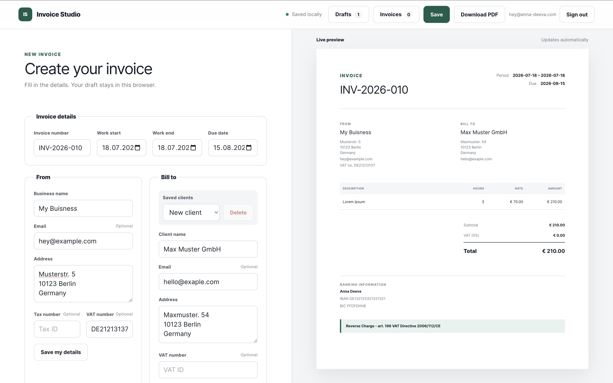
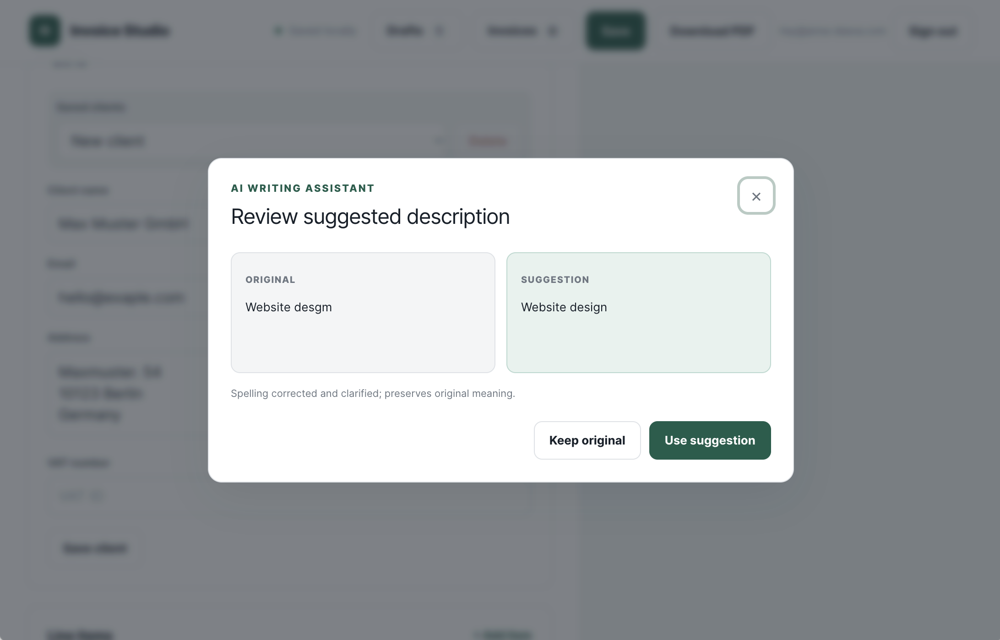
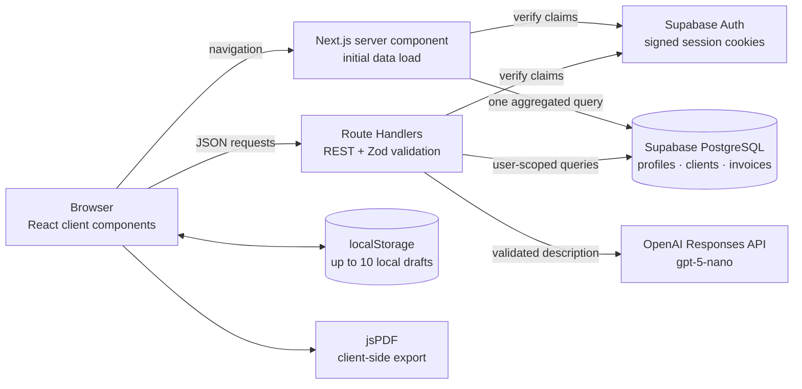

# Simple Invoice Generator

[](https://github.com/temhota/simple-invoice-generator/actions/workflows/ci.yml)
[](https://simple-invoice-generator-alpha.vercel.app)
[](https://nextjs.org/)
[](https://www.typescriptlang.org/)

A production-oriented invoice workspace for freelancers: build an invoice with a live preview, reuse client and business data, track invoice status, improve line-item descriptions with AI, and export a validated PDF.

**[Open the live demo →](https://simple-invoice-generator-alpha.vercel.app)**

> The demo requires an account because invoices contain personal, banking, and tax information. Email confirmation may be required by the configured Supabase project.

## Product tour

The main workspace keeps editing and output side by side: form changes update the invoice preview immediately, while saved profiles, clients, and invoices remain available across devices.

<p align="center">
  
</p>

<p align="center"><em>Invoice builder and live preview, including VAT, banking details, and reverse-charge output.</em></p>

The AI assistant is deliberately review-first: it returns structured output, explains the change, and waits for the user to accept or reject the suggestion.

<p align="center">
  
</p>

<p align="center"><em>Original and suggested descriptions remain visible until the user makes an explicit choice.</em></p>

## What it does

- Builds invoices with issuer, client, work-period, banking, VAT, reverse-charge, notes, and line-item data.
- Shows a live document preview and exports the same validated data to PDF.
- Stores reusable profiles, clients, and invoice records in PostgreSQL.
- Tracks invoice lifecycle as draft, sent, or paid and generates the next invoice number per user.
- Keeps up to ten intentionally local browser drafts for quick recovery.
- Uses `gpt-5-nano` to improve a line-item description, then shows the original and suggestion before applying anything.
- Supports EUR, USD, and GBP without floating-point money calculations.

## Architecture



The authenticated page loads profile, clients, invoices, and the next invoice number on the server. Interactive editing stays in a client component; mutations cross a small REST boundary and are validated again before PostgreSQL is touched.

## Key product decisions

| Decision | Why it exists |
| --- | --- |
| Live preview beside the form | Invoice formatting problems are visible before export, not after downloading a PDF. |
| Integer cents and basis points | Avoids floating-point rounding errors in prices and VAT. One deterministic calculation path powers preview and PDF. |
| Explicit AI review step | AI never silently rewrites billable work. The user compares both versions and decides whether to apply the suggestion. |
| Server-first initial load | Avoids a client-side request waterfall and renders authenticated data from one aggregated PostgreSQL query. |
| Cloud records plus local drafts | Important records are available across devices; incomplete scratch work can remain local and fast. |
| Per-user invoice numbering | `INV-YYYY-NNN` advances independently for every account and is protected by a database uniqueness constraint. |
| Client-side PDF generation | Export is immediate and does not require storing a generated document on the server. |

## Security model

Security is enforced in layers rather than relying on the UI:

1. The Next.js session proxy refreshes Supabase cookies, redirects unauthenticated page requests, and returns `401` for unauthenticated API calls.
2. Every protected server component and Route Handler verifies signed Supabase claims and derives `userId` from the session—not from request JSON.
3. Zod validates invoices, contacts, dates, VAT rules, money limits, and AI payloads at server boundaries.
4. Every PostgreSQL query is scoped by `user_id`; database uniqueness constraints and foreign keys preserve ownership and consistency.
5. Supabase Row Level Security policies protect owner-scoped access through Supabase's Data API; application queries also include explicit `user_id` filters.
6. `DATABASE_URL` and `OPENAI_API_KEY` are server-only environment variables. They are never exposed through `NEXT_PUBLIC_*` names.
7. AI requests use `store: false`, a hashed safety identifier, structured output validation, and a per-user limit of 20 requests per 24-hour window.

The application does not store generated PDF files. Local drafts live in that browser's `localStorage`, so users should not use the draft feature on an untrusted shared device.

## Why REST instead of GraphQL?

The data model exposes a small, task-oriented surface: profile, clients, invoices, next invoice number, and one AI operation. REST Route Handlers fit those bounded resources without introducing a schema server, resolver layer, generated client, normalized cache, or a second authorization surface.

GraphQL would become attractive if the product gained several independent clients, deeply nested user-configurable queries, or enough screens that over-fetching and request composition became measurable problems. For the current scope, typed TypeScript contracts plus Zod validation keep the network boundary simpler and easier to audit.

## Trade-offs

- **Direct PostgreSQL access:** keeps the server data layer small, but schema changes require explicit SQL migrations and careful connection management in serverless environments.
- **Invoice JSON snapshot:** makes historical invoices easy to reconstruct as their full document shape, but reporting on individual line items would benefit from normalized tables later.
- **Client-side PDF:** provides fast, private export, but font embedding and pixel-perfect parity across every browser need dedicated visual regression coverage.
- **`localStorage` drafts:** work offline and require no extra API, but do not sync across browsers and are not encrypted independently of the device.
- **Fixed VAT choices:** 0% and 19% plus reverse charge cover the initial use case, not every jurisdiction or tax regime.
- **Simple AI rate limit:** a PostgreSQL-backed 24-hour window is transparent and sufficient at this scale; a high-traffic system would move this concern to a dedicated distributed limiter.
- **Single app repository:** keeps UI, server endpoints, migrations, and tests close together, while larger teams might split ownership and deployment boundaries.

## Tech stack

- Next.js 16 App Router, React 19, and strict TypeScript
- React Hook Form and Zod
- Supabase Auth and PostgreSQL via `postgres.js`
- OpenAI Responses API with structured outputs
- jsPDF for browser-side PDF generation
- Vitest and Testing Library-compatible `jsdom`
- Vercel for deployment and GitHub Actions for CI

## Run locally

Requirements: Node.js 24, pnpm, a PostgreSQL database, and a Supabase project for authentication.

```bash
pnpm install
cp .env.example .env.local
pnpm db:migrate
pnpm dev
```

Configure `.env.local`:

```dotenv
DATABASE_URL=postgresql://...
DATABASE_SSL=require
NEXT_PUBLIC_SUPABASE_URL=https://your-project.supabase.co
NEXT_PUBLIC_SUPABASE_PUBLISHABLE_KEY=...
NEXT_PUBLIC_SITE_URL=http://localhost:3000
OPENAI_API_KEY=...
```

- `DATABASE_URL` and `OPENAI_API_KEY` must remain server-only.
- Set `DATABASE_SSL=disable` only for a trusted local PostgreSQL server without TLS.
- Add both local and production origins to **Supabase → Authentication → URL Configuration**.
- `OPENAI_API_KEY` is needed only for AI description suggestions; the rest of the invoice workflow does not depend on OpenAI.

Then open [http://localhost:3000](http://localhost:3000).

## CI and quality gates

GitHub Actions runs on every pull request and every push to `main`. Concurrent runs for an outdated commit are cancelled.

| Step | Command | What it catches |
| --- | --- | --- |
| Reproducible install | `pnpm install --frozen-lockfile` | Lockfile drift and dependency resolution problems |
| Type safety | `pnpm typecheck` | Next.js route type errors and strict TypeScript errors |
| Static analysis | `pnpm lint` | ESLint and Next.js correctness issues |
| Unit tests | `pnpm test` | Money, invoice validation, formatting, and AI response contract regressions |
| Production build | `pnpm build` | Bundling, server/client boundary, route, and prerender failures |
| End-to-end tests | `pnpm test:e2e` | Auth redirects, unauthorized API access, live preview, local drafts, and PDF downloads |

Database integration tests are enabled when `TEST_DATABASE_URL` points to a disposable PostgreSQL database; they are skipped otherwise.

The Cypress suite always runs the public authentication-boundary checks. Its authenticated invoice workflow runs when CI has a dedicated Supabase test account configured through `E2E_EMAIL`, `E2E_PASSWORD`, `E2E_SUPABASE_URL`, `E2E_SUPABASE_PUBLISHABLE_KEY`, and `E2E_DATABASE_URL` repository secrets. Pull requests without those secrets still run the public smoke tests.

Run the same gates locally:

```bash
pnpm typecheck
pnpm lint
pnpm test
pnpm build
```

For Cypress, start the application in one terminal and run the test runner in another:

```bash
pnpm dev

# Headless
pnpm test:e2e

# Interactive
pnpm test:e2e:open
```

Set `CYPRESS_E2E_EMAIL` and `CYPRESS_E2E_PASSWORD` in the shell to enable the authenticated workflow locally. Use a dedicated test account rather than a personal account.

## Repository map

```text
app/            server components, auth flow, and REST Route Handlers
components/     invoice builder, preview, header, and comparison dialog
lib/            domain logic, validation, PDF generation, and data access
migrations/     PostgreSQL schema, ownership, RLS, and AI usage limits
scripts/        migration runner
.github/        CI workflow
```

## Future work

- Visual regression tests for the preview and generated PDF
- Normalized line items for revenue and client reporting
- Configurable taxes, locales, payment terms, and invoice templates
- Accessible focus trapping and broader keyboard coverage for dialogs
- Optional server-side PDF archiving and email delivery
